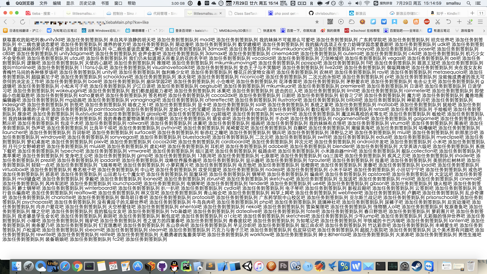
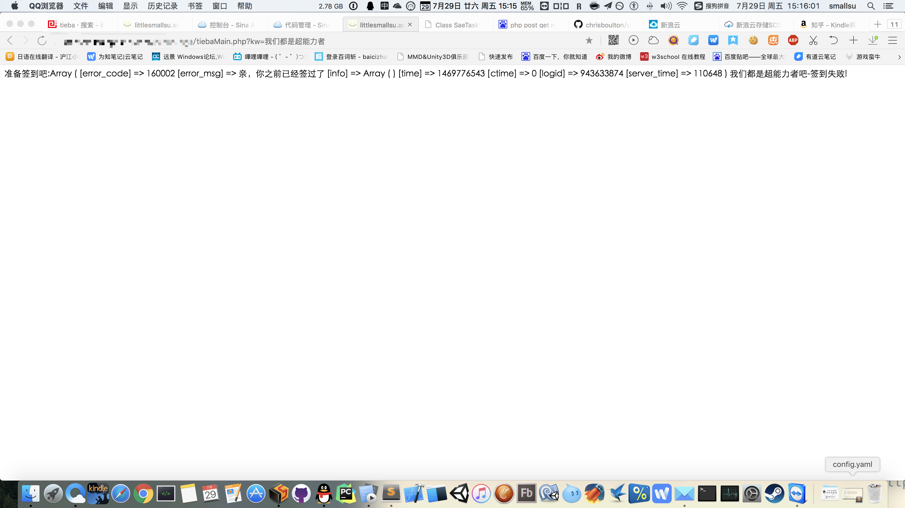

# Tieba-Cloud-Sign-For-SAE-With-PHP5.6

# 介绍

自己做的贴吧云签到小轮子，架设在SAE服务器上，不需要MySQL和Redis，只利用了类似TaskQuery和Corn之类的任务队列服务和定时服务。

基本上参考网上比较出名的贴吧签到机来改造的，感觉应该核心的爬虫功能模块也跑了2年，算比较稳定了。基本上使用也不会有太大问题，反正代码难度不会太大，有兴趣的可以自己看看研究研究。

# 使用方法。

1.获取喜欢的贴吧列表并把签到任务推入队列 http://服务器地址/tiebaMain.php?kw=like

2.对具体某个贴吧进行签到 http://服务器地址/tiebaMain.php?kw=贴吧名

# 添加定时执行的功能

```
name: appname
version: 1
handle:

cron:
	# 每天上午6点签到
	- description: sign tieba in morning
		url: /public/sign/tiebaMain.php?kw=like
		schedule: "8 6 * * *"
	# 每天下午6点签到
	- description: sign tieba in evening
		url: /public/sign/tiebaMain.php?kw=like
		schedule: "8 18 * * *"
```

# 上面描述的截图


